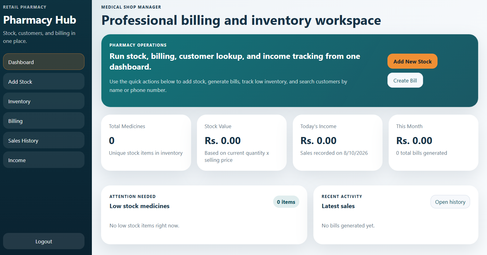

# Medical Shop Manager App

A web-based Medical Shop Manager application designed to help medical shop owners manage medicines, stock, billing, and daily operations through a simple and user-friendly interface.

## Live Demo

[Open Medical Shop Manager App](https://yashwanthrevu9.github.io/medical-shop-app/)
## Dashboard Preview



## Features

- Secure login and authentication
- Medicine and stock management
- Medicine barcode scanning
- Real-time stock updates
- Automatic invoice generation
- Billing management
- Customer management
- Simple and responsive user interface
- Local data storage

## Technologies Used

- HTML5
- CSS3
- JavaScript
- Barcode Scanner Library
- LocalStorage API

## Project Structure

```text
medical-shop-app/
│
├── index.html
├── login.html
├── style.css
├── app.js
├── auth.js
└── README.md
